 Installation
=======================
(http://developer.plone.org/getstarted/installation.html)

    Installation instructions for Plone for various operating systems and situations.

Introduction
=============

This document covers the basics of installing Plone on popular operating systems.
It will also point you to other documents for more complex or demanding installations.

Plone runs as an application on the Zope application server. That server is installed automatically by the install process.

    We strongly advise against installing Plone via OS package or port. There is no .rpm, .deb, or BSD port that is supported by the Plone community. Plone dependencies can and should be installed via package or port -- but not Plone itself.

Download Plone
===================

Plone is available for Microsoft Windows, Mac OSX X, Linux and BSD operating systems.

`Download the latest Plone release <http://plone.org/products/plone/latest_release>`_.

Binary installers are available for Windows and OS X. Installation on Linux, BSD and other Unix workalikes requires a source code installation, made easy by our Unified Installer. "Unified" refers to its ability to install on most Unix workalikes.

Plone installation requirements
========================================================

See `Plone installation requirements <requirements>` for detailed requirements.

* You need at a dedicated or virtual private server (VPS) with 512 MB RAM available.
  Shared hosting is not supported unless the shared hosting company says Plone is good to go.
  See `Plone installation requirements <requirements>`.

* If you are installing for production — rather than testing or evaluation — review `Deploying and installing Plone in production </reference_manuals/active/deployment>` before installation.

How to install Plone
========================================================

Plone can run on all popular desktop or server operating systems, including
Linux, OS X, BSD and Microsoft Windows.

* You may install Plone on the server for production usage

* You may install Plone locally on your own computer for the development and test drive

Ubuntu / Debian
---------------

We describe Ubuntu/Debian installation in detail as an example of installation on a common Unix workalike. The only difference for most other systems would be in package-manager commands and package names. See `Plone installation requirements <requirements>` for package names and commands on other platforms.

#Installing Plone using the Unified UNIX Installer
  This is the recommended method for
  a *development or evaluation* installation of Plone on a Unix workalike.
  For a *production* installation, `Installing Plone for Production on Ubuntu </getstarted/ubuntu_production>` is a much better guide.

This recipe is good for:

* Plone development and testing on Ubuntu / Debian

* Operating system installations where you have administrator (root) access. Note that
  root access is not strictly necessary as long as you have required software installed
  beforehand on the server, but this tutorial assumes you need to install the software
  yourself and you are the admin. If you don't have the ability to install system libraries, you'll need to get your sysadmin to do it for you. The libraries required are in common use.

The resulting installation is self-contained,
does not touch system files,
and is safe to play with (no root/sudoing is needed).

If you are not familiar with UNIX operating system commad line
you might want to study this `Linux shell tutorial <http://linuxcommand.org/learning_the_shell.php>`_
first.

For information on using this installation with more advanced production
hosting environments and deployments,
see the `hosting guide </hosting>`.

Instructions are tested for the *Ubuntu 12.04 Long Term Support* release.

Install the operating system software and libraries needed to run Plone
~~~~~~~~~~~~~~~~~~~~~~~~~~~~~~~~~~~~~~~~~~~~~~~~~~~~~~~~~~~~~~~~~~~~~~~

 

    sudo apt-get install python-setuptools python-dev build-essential libssl-dev libxml2-dev libxslt1-dev libbz2-dev libjpeg62-dev

You will probably also want these optional system packages (see `Plone manual for more information <http://plone.org/documentation/manual/installing-plone/installing-on-linux-unix-bsd/debian-libraries>`_):

    sudo apt-get install libreadline-dev wv poppler-utils

note:

    **libreadline-dev** is only necessary if you wish to build your own python rather than use your system's python 2.7.

If you're planning on developing with Plone, install git version control support::

    sudo apt-get install git

note:

    If sudo command is not recognized or does not work you don't have administrator rights to Ubuntu / Debian operating system.
    Please contact your server vendor or consult the operating system support forum.

Download the latest Plone unified installer
~~~~~~~~~~~~~~~~~~~~~~~~~~~~~~~~~~~~~~~~~~~

Download from `the plone.org download page <http://plone.org/download>`_ to your server using wget command. Curl also works.
Substitute the latest version number for 4.3.2
in the instructions below.

    wget --no-check-certificate https://launchpad.net/plone/4.3/4.3.2/+download/Plone-4.3.2-UnifiedInstaller.tgz

###Run the Plone installer in standalone mode

    # Extract the downloaded file
    #
    tar -xf Plone-4.3.2-UnifiedInstaller.tgz
    #
    # Go the folder containing installer script
    #
    cd Plone-4.3.2-UnifiedInstaller
    #
    # Run script
    ./install.sh standalone

install.sh has many options, use:

    ./install.sh --help

to discover them.

The default admin credentials will be printed to the console.
You can change this password after logging in to the Zope Management Interface.

   The password is also written down in the ``buildout.cfg`` file, but this
   setting is not effective after Plone has been started for the first time.
   Changing this setting does not do any good.

###Install the Plone developer tools

If you're using this Plone install for development, add the common development tool set.

    cd ~/Plone/zinstance
    bin/buildout -c develop.cfg

You'll need to add the "-c develop.cfg" again each time you run buildout, or you'll lose the extra development tools.

###Start Plone

If you're developing, start Plone in foreground mode for a test run (you'll see potential errors in the console):

    cd ~/Plone/zinstance
    bin/plonectl fg

When you start Plone in the foreground, it runs in debug mode, which is much slower than production mode since it reloads templates for every request.

For evaluation, instead use:

    cd ~/Plone/zinstance
    bin/plonectl start

Use

    cd ~/Plone/zinstance
    bin/plonectl stop

to stop the instance.

By default, Plone will listen to port 8080 on available network interfaces.
That may be changed by editing buildout.cfg and re-running buildout.

### You've got Plone

Now take a look at your Plone site by visiting the following address in your webbrowser::

    http://yourserver:8080

The greeting page will let you create a new site.
For this you need the login credentials printed to your terminal earlier, also available at ``~/Plone/zinstance/adminPassword.txt``.

If everything is OK, press ``CTRL-C`` in the terminal to stop Plone if you're running in debug mode. Use the ``plonectl stop`` command if you didn't start in debug mode.

If you have problems, please see the `help guidelines <http://plone.org/help>`_.

For automatic start-up when your server boots up, init scripts, etc.
please see the `hosting guide </hosting>`.

### Installing Plone using buildout on Ubuntu / Debian

Here are quick instructions to install Plone using a pre-installed buildout and the OS-provided
Python interpreter.
This procedure is only useful if you know buildout well enough to
tailor your own buildout configuration.

You need to manage dependencies (``Python``, ``libxml``, ``Pillow``) yourself.

This will:

* create a default ``buildout.cfg`` configuration file and folder structure
  around it;

* automatically download and install all packages from `pypi.python.org <pypi.python.org>`_;

* configure Plone and Zope for you.

1. Install ``virtualenv`` for python (on Ubuntu):

    

        sudo apt-get install python-virtualenv

2. Create a ``virtualenv`` where you can install some Python packages
   (``ZopeSkel``, ``Pillow``):

    

        virtualenv plone-virtualenv

3. In this virtualenv install ``ZopeSkel`` (from the release 2 series):

    

        source plone-virtualenv/bin/activate
        easy_install "ZopeSkel<2.99"

4. Create Plone buildout project using ZopeSkel:

    

        paster create -t plone4_buildout myplonefolder

5. Optionally edit ``buildout.cfg`` at this point.
   Run buildout (use Python 2.6 for Plone 4.1):

    

    python2.6 bootstrap.py
    bin/buildout

More info:

* `ZopeSkel </getstarted/paste>`
* `virtualenv <http://pypi.python.org/pypi/virtualenv>`_
* `Pillow <http://pypi.python.org/pypi/Pillow/>`_
* `lxml <http://lxml.de/>`_

### Installing Plone using RPMs, .dev, ... packages

Not supported by Plone community.

(i.e. you're on your own, and don't say we didn't tell you.)

Microsoft Windows
-------------------------

###Installing Plone on Windows

By far the easiest way to install on Windows is to use the binary installer provided on plone.org. This installation is adequate for Python development.
It is very rare to need C language extensions.

If you have needs beyond those met by the Windows Installer, read on.

For Plone 4.1 and later, see these instructions:

* https://docs.google.com/document/d/19-o6yYJWuvw7eyUiLs_b8br4C-Kb8RcyHcQSIf_4Pb4/edit

If you wish to develop Plone on Windows you need to set-up a working MingW
environment (this can be somewhat painful if you aren't used to it):

* http://plone.org/documentation/kb/using-buildout-on-windows

OSX
----------------------------------------------------

### Installing Plone using OSX binary installer

This is the recommended method if you want to try Plone for the first time.

Please use the installer from the download page `<http://plone.org/products/plone/releases>`_.

The binary installer is intended to provide an environment suitable for testing, evaluating, and developing theme and add-on packages.
It will not give you the ability to add or develop components that require a C compiler.
This is *very* rarely needed.

### Installing Plone from source on OS X

Installation via the Unified Installer or buildout is very similar to Unix. However, you will
need to install a command-line build environment. To get a free build kit from Apple, do one of the following:

* Download gcc and command-line tools from
  https://developer.apple.com/downloads/. This will require an Apple
  developer id.

* Install Xcode from the App Store. After installation, visit the Xcode
  app's preference panel to download the command-line tools.

After either of these steps, you immediately should be able to install Plone using the Unified Installer.

Proceed as with Linux.

LibXML2/LibXSLT Versions
------------------------

If you are installing Plone 4.2+ or 4.1 with Diazo, you will need up-to-date versions of libxml2 and libxslt::

    LIBXML2 >= "2.7.8"
    LIBXSLT >= "1.1.26"

Ideally, install these via system packages or ports. If that's not possible,
use most current version of the z3c.recipe.staticlxml buildout recipe to build an lxml (Python wrapper) egg with static libxml2 and libxslt components.

Don't worry about this if you're using an installer.

Entering debug mode after installation
=========================================

When you have Plone installed and want to start
development you need do `enter debug mode </getstarted/debug_mode>`.

Installer source code
======================

* https://github.com/plone/Installers-UnifiedInstaller

# Installing Plone add-ons - quick instructions
(http://plone.org/documentation/kb/installing-add-ons-quick-how-to)

by Mikko Ohtamaa — last modified Nov 05, 2013 04:59 PM
These instructions cover add-on installation process for Plone 3.3.x and 4 installation.
Introduction
This page covers add-on installation instructions for Plone 3.3.x and Plone 4 systems. Legacy systems are not covered in these instructions.

For more detailed add-on installation procedure, you might want to visit the complete add-on installation guide for Plone.

## Prerequisitements
What you need to know in order to install add-ons for Plone

How to use command line of your operating system. This is a hard requirement - you cannot achieve your goal unless you know how to interact with the command line. Here are basics tutorials for Windows and UNIX.
Working with plain text based configuration files and editing them with a text editor like Notepad
First create a development / back-up copy of your site. Never install to the working production server directly.
Background
Since Plone 3, Plone installations are managed using buildout: a tool for repeatable deployment process. Plone add-ons are distributed as Python modules, also known as eggs.

Plone product download area contains popular add-ons for Plone
Add-on file downloads are hosted on PyPi Python package repository - along with tons of other Python software
buildout.cfg file in your Plone configuration defines which add-ons are available for your sites to install in Site Setup > Add-ons control panel
bin/buildout command (or bin/buildout.exe on Windows) in your Plone installation reads buildout.cfg and automatically downloads required packages when run - you do not need to download any Plone add-ons manually
Plone site setup -> Add ons control panel defines which add-ons are installed for the current Plone site (of many Plone sites on Zope application server)
Plone add-ons, though Python eggs, must be installed through buildout as only buildout will regenerate the config files reflecting newly downloaded and installed eggs. Other Python installation tools like easy_install and pip do not apply in Plone context.

#### Finding add-ons
Browse plone.org product area or PyPi search for possible add-ons.

When you find a suitable add-on you must write down its Python package id. If the package vendor does not tell this directly on the package page it might need you diving into PyPi to find out. For example, for package Plone SEO the package id is quintagroup.seoptimizer. The id is visible in PyPi page URL if it is not mentioned anywhere else.

Before proceeding make sure that the add-on is compatible with your Plone version. If you cannot find this information on the package page please contact the add-on author.

#### Downloading and configuring add-on package for Plone
It is suggested that you do not directly test new add-ons on your product site. Instead, have a development copy of the site around where you can safely test the add-ons. Before proceeding to the production environment, always take a back up copy of your Plone site.

Edit file buildout.cfg in your Plone folder with a text editor. Find line

	eggs = 
	There you can include your package in the  list.

	eggs = 
	quintagroup.seoptimizer
Some older Plone add-ons (released before Plone 3.3.x) also require you to add add-on package name to zcml= section in buildout.cfg. As a a rule of the thumb, all add-ons released since  the second half of 2010 should no longer require this.

After the buildout.cfg has been file has been changed run command buildout from command line. buildout command reads buildout.cfg file and download the packages defined in eggs section and make them available for Plone.

Note: Run buildout from command line using the instructions below. You don't double click buildout.exe.

 

#### On UNIX

	bin/buildout

#### On Windows (for Plone 4.1)

	cd C:\Plone41
	bin\buildout.exe
	
If buildout fails please follow these instructions to diagnose add-on installation problems.

Downloading and configuring add-on package from github
Sometimes you need the newest version of an add-on, this is only suggested for experienced developers or for testing purposes.

Edit file buildout.cfg in your Plone folder with a text editor and add:

extensions = mr.developer
auto-checkout = name.of.your.product

[sources]
name.of.your.product = git git://github.com/url/of/name/of/you/product
and under the section [eggs] add your buildout.cfg:

[eggs]
....
....
name.of.your.product
After the buildout.cfg has been file has been changed run command buildout from command line. buildout command reads buildout.cfg file and download the packages defined in eggs section and make them available for Plone.

Note: Run buildout from command line using the instructions below. You don't double click buildout.exe.

 

### On UNIX

	bin/buildout

#### On Windows (for Plone 4.1)

	cd C:\Plone41
	bin\buildout.exe

If buildout fails please follow these instructions to diagnose add-on installation problems.

Enabling the add-on for your site
When buildout command completes succesfully you need to restart Plone site in order to make the new add-on appear in Plone site setup -> Add ons control panel. It is recommended that for the first add-on trial you start the site in debug mode.

The site is controlled by controller script. It name may vary depending on the installation - it may be either plonectl or instance. We assume instance here. First stop the site.

### On UNIX

	bin/instance stop
	
### On Windows

	bin\instance.exe stop

Then start the site in the debug mode. You can exit the debug mode by pressing CTRL+C key combination in the terminal.

### On UNIX

	bin/instance fg

### On Windows

	bin\instance.exe fg
	
Then navigate your way on the site setup in Plone control panel. You should see the new add-on in the add-ons list.

If the add-on does not appear to the list or if Plone site fails to start in debug mode, the most probably cause is that the add-on is not compatible with your Plone version. In any case, please follow these instructions to diagnose add-on installation problems.

Wrapping it up
After you have verified that the add-on works with your Plone configuration you can resume your site in production mode running.

 

### On UNIX

	bin/instance start

### On Windows

	bin\instance.exe start

Then proceed to adjust the add-on settings according to the add-on manual.

Further help
More detailed instructions for installing Plone add-ons are available for dealing with legacy systems.

Please visit on Plone help asking guidelines and Plone support options page to find further help if these instructions are not enough. Also, contact the add-on author, as listed on Plone product page, to ask specific instructions regarding a particular add-on.

Contribute
Something wrong or out of date? Anybody can edit or create a new article in the knowledge base. Simply create an account on this site, log in, and click the Edit button to contribute.

Create a Plone theme product with Diazo
=======================================

Introduction
------------

Creating a theme product with the Diazo inline editor is an easy way to start
and to test, but it is not a solid long term solution.

Even if ``plone.app.theming`` allows to import and export a Diazo theme as a ZIP
archive, it might be prefereable to manage your theme into an actual Plone
product.

One of the most obvious reason is it will allow you to override Plone elements
that are not accessible from the pure Diazo features (like overloading content
views templates, viewlets, configuration settings, etc.).

Create a product to handle your Diazo theme
-------------------------------------------

Create a module

To create a blank module, you will use ZopeSkel. ZopeSkel is part of the
executables files deployed in ``./bin`` on a standard UnifiedInstaller install
once you have run the develop.cfg buildout::

    bin/buildout -Nc develop.cfg

ZopeSkel allows to initialize Python modules based on different templates.

You will use the template named ``plone``.

Into your Plone install, go to src/, and launch the following command::

    $ ../bin/zopeskel plone

Give a name to your module (for instance: projectname.theme).
And just accept all the default choices but::

    Register Profile (Should this package register a GS Profile) [False]: True

The module is created in ``src/projectname.theme``.

Declare this new module in your ``buildout.cfg``::

    develop =
        ...
        src/projectname.theme

    eggs =
        ...
        projectname.theme

And run buildout::

    $ bin/buildout -Nv

Put your Diazo theme in the module

Create a folder for the Diazo resources::

    $ mkdir src/projectname.theme/projectname/theme/static

Download your theme created using the inline editor and unzip it in that folder.

Modify the ``configure.zcml`` file to declare this ``static`` folder::

    <configure
        ...
        xmlns:plone="http://namespaces.plone.org/plone"
        >

        ...

        <plone:static name="projectname.theme" directory="static" type="theme" />

        ...

    </configure>

Update the GenericSetup profile

In ``src/projectname.theme/projectname/theme/profiles/default/``, you have to:

- Add the dependency with ``plone.app.theming`` in ``metadata.xml``::

    <?xml version="1.0"?>
    <metadata>
      <version>1000</version>
      <dependencies>
        <dependency>profile-plone.app.theming:default</dependency>
      </dependencies>
    </metadata>

- Declare the theme by creating ``theme.xml``::

    <?xml version="1.0"?>
    <theme>
      <name>projectname.theme</name>
      <enabled>true</enabled>
    </theme>

Then you can restart Zope, and install the new product to activate the theme.

Override the Plone skin
-----------------------

Diazo allows to control the global rendering of the Plone pages.

But if you need to change elements which are deeply melt into the Plone
generated content, or which are not easily accessible using a CSS selector, or
maybe an image (for instance, the members default portrait, ``defaultUser.png``)
which are provided by the Plone skin, you will have to override the Plone skin.

.. note::
    that is basically what you do when you go to ZMI / portal_skins and 
    click on the ``Customize`` button. But here, you will do that from the sources.

To override Plone skin elements from our product, you will need to:

    Create a folder
    ``src/projectname.theme/projectname/theme/skins/projectname_custom`` and put
    the needed resources in that folder (like your new version of
    ``defaultUser.png``). It can be anything, you just need to make sure it as
    the very same name as the original one.

    Declare that folder in configure.zcml::

        <configure

            ...

            xmlns:cmf="http://namespaces.zope.org/cmf"
            >

          ...
          
          <cmf:registerDirectory name="projectname_custom"/>

        </configure>

    And move it in first position compare to the other existing skin layers by
    creating
    ``src/projectname.theme/projectname/theme/profiles/default/skins.xml``::

        <?xml version="1.0"?>
        <object name="portal_skins" allow_any="False" cookie_persistence="False" default_skin="projectname.theme">

          <object name="projectname_custom"
              meta_type="Filesystem Directory View"
              directory="projectname.theme:skins/projectname_custom"/>
          <skin-path name="projectname.theme" based-on="Sunburst Theme">
            <layer name="projectname_custom"
                insert-after="custom"/>
          </skin-path>

        </object>

    You can now restart Zope and re-install your product from the Plone control
    panel (Site Setup > Add-ons), once done, the elements contained in 
    ``projectname_custom`` will take priority on the corresponding elements from
    the Plone skin (or any other add-on skin).

Override Plone BrowserViews with jbot
-------------------------------------

A large part of the Plone UI are not provided by the portal_skins layers but by
BrowserViews.

That is the case for viewlets (all the blocks you can see when you call the url
``./@@manage-viewlets``).

.. note:: to override them from the ZMI, you can go to ``./portal_view_customizations``.

To overrides them from your theme product, the easiest way is to use
``z3c.jbot`` (Just a Bunch of Templates).

First of all you need to add this module in ``buildout.cfg``::

    eggs =
        ...
        z3c.jbot

And run buildout::

    $ bin/buildout -Nv

Then create a folder
``src/projectname.theme/projectname/theme/static/overrides``.

And declare that folder as a jbot folder:

- modify configure.zcml::

    <configure

        ...

        xmlns:browser="http://namespaces.zope.org/browser"
        >

        ...
      
        <include package="z3c.jbot" file="meta.zcml" />
        <interface name="projectname.theme"
            interface="projectname.theme.interfaces.IThemeSpecific"
            type="zope.publisher.interfaces.browser.IBrowserSkinType"
            />
        <browser:jbot directory="static/overrides" />

    </configure>

- create ``interfaces.py``::

    from plone.theme.interfaces import IDefaultPloneLayer

    class IThemeSpecific(IDefaultPloneLayer):
        """Marker interface that defines a Zope 3 browser layer and a plone skin marker.
        """

- and declare a layer by creating ``src/projectname.theme/projectname/theme/profiles/default/browserlayer.xml``::

    <?xml version="1.0"?>
    <layers>

      <layer name="projectname.theme" interface="projectname.theme.interfaces.IThemeSpecific"/>

    </layers>

Then, you can put in
``src/projectname.theme/projectname/theme/static/overrides`` all the templates
you want to override but you will need to name them by prefixing the template
name by its complete path to its original version.

For instance, to override ``colophon.pt`` from plone.app.layout, knowing this
template in a subfolder named ``viewlets``, you need to name it
``plone.app.layout.viewlets.colophon.pt``.

.. note:: ZMI > portal_view_customizations is an handy way to find the template path.

You can now restart Zope and re-install your product from the Plone control
panel (Site Setup > Add-ons).

Manage CSS and JS in registries
-------------------------------

For performances reasons, it is recommended to minimize the amount of JS and CSS
files loaded in you pages.

To do that, Plone offers two registries, ``portal_javascript`` and
``portal_css``, which allow to:

    - declare resources you want to load,
    - sort them,
    - if needed, specify conditions to decide when a resource must be loaded or not.

Using those information, Plone will inject the corresponding tags (``<script>``,
``<link>``, etc.) in the ``<head>``, and if Zope does not run in debug mode, the
different files will be merged and compressed.

It is obviously important to manage your theme's main CSS and JS that way.

To do so, you first need to **remove them from your theme HTML templates** (so
you do not make things worse by loading them twice).

Then, declare them to the registries:

    Create a file
    ``src/projectname.theme/projectname/theme/profiles/default/jsregistry.xml``::

        <?xml version="1.0"?>
        <object name="portal_javascripts">

            <javascript id="++theme++projectname.theme/js/theme.js"
                cacheable="True"
                compression="none"
                cookable="True"
                enabled="True"
                expression="request/HTTP_X_THEME_ENABLED | nothing"
                inline="False"
                insert-after="++resource++collective.js.leaflet/leaflet.js"
            />

        </object>

    And a file
    ``src/projectname.theme/projectname/theme/profiles/default/cssregistry.xml``::

        <?xml version="1.0"?>
        <object name="portal_css">

          <stylesheet
            id="++theme++projectname.theme/css/theme.css"
            applyPrefix="1"
            media=""/>

          <stylesheet
            id="++theme++projectname.theme/bootstrap/css/bootstrap.css"
            applyPrefix="1"
            media=""/>

        </object>

You can now restart Zope and re-install your product from the Plone control
panel (Site Setup > Add-ons).

.. note:: the expression ``request/HTTP_X_THEME_ENABLED | nothing`` returns True only if the page is served through Diazo (it allows to avoid to load the resources when the Diazo theme is not active).

You have to be careful about the resources order and their conditions: resources
are merged together in the order they are declared with as far as the condition
are the same.

If the next resource as a different condition, it will end the current merged
set of resources, and start a new one.

So if you want to minimize the total number of resulting files, you have to:

    - declare as few conditions as possible,
    - when you have to declare a condition, try to make them identical if possible,
    - and re-order the resources in such a way that similar conditions are consecutives.

Regarding the JS or CSS which are not used globally into the web site, but just 
in a very specific template, it might be better to not declare them in the
registries, and let them declared manually into the static HTML /template.

	note: if you use a responsiveCSS framework, it is often useful to deactivate the Plone ``mobile.css`` file which might produces bad formatting (typically with Boostrap). To do so, you add the following to ``cssregistry.xml``::

        <stylesheet id="mobile.css" enabled="False" />

http://developer.plone.org/reference_manuals/external/tutorials.todoapp/docs/index.html
Through-The-Web
==========================

Getting Started with Content Types
==================================

If you don't know what a content type is, don't worry! Sit back, relax, and do
the tutorial! I'll save the mumbo jumbo definitions for another day. In this
first part, we will make a Todo list without touching any code. It won't be
fancy, but it will give you a good idea of how things work in Plone.

The way Plone handles content is a little different than your average
relational database driven framework, so if you don't understand something
right away, sit back, relax, and finish the tutorial.

Generally speaking, content-types are just that: types of content. By default,
in Plone you get the News Item content-type, the Event content-type and so on.
So if you add a content item that is of Event type, you are using the Event
content-type. In our case, we will create a new content-type that will
represent a Todo Item.

Create a New Content Type
-------------------------

First we need to create a new content type to represent an item on our Todo
list. This will be a type with one field, that which needs to be done.

### Navigate to `site setup` as shown below, or just enter
   ``http://localhost:8080/Plone/@@overview-controlpanel`` in your browser.
   This is where you can configure Plone for happy fun time.

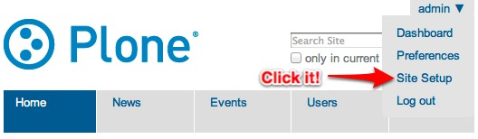

### Now comes the fun part. We want to create our own type `Through-The-Web`
   aka. `TTW`. This type will be a Todo Item. Let’s click `Dexterity Content
   Types` (or go directly to
   ``http://localhost:8080/Plone/@@dexterity-types``).

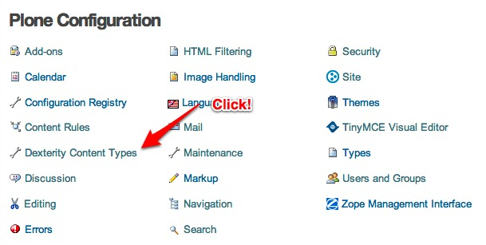

### Create a Todo List Item by clicking ``Add New Content Type``.

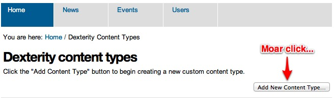

### Fill in the fields as seen below and then click ``Add``.

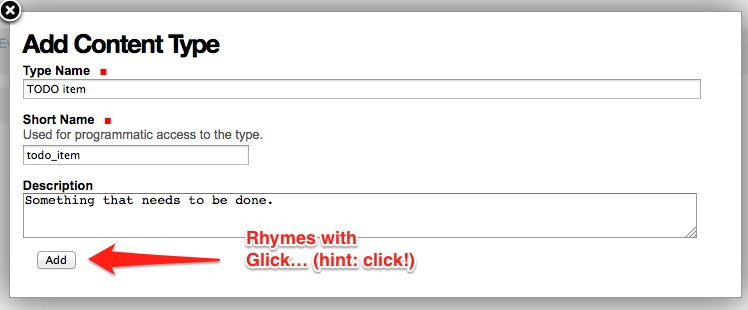

### Now you will see that there is a new type to play with. There are two
   important things we need to do here: we need to adjust some `behaviors`,
   and add some `fields`. Let’s look at behaviors first.

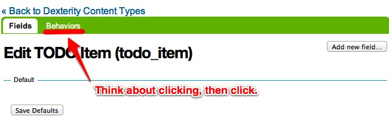

### By default, all Plone content-types have `Dublin Core
   <http://en.wikipedia.org/wiki/Dublin_Core>`_ metadata enabled (you may know
   it as ``title`` and ``description``. We don’t need this for our über simple
   Todo list item. Uncheck ``Dublin Core metadata`` and then click ``Save``.

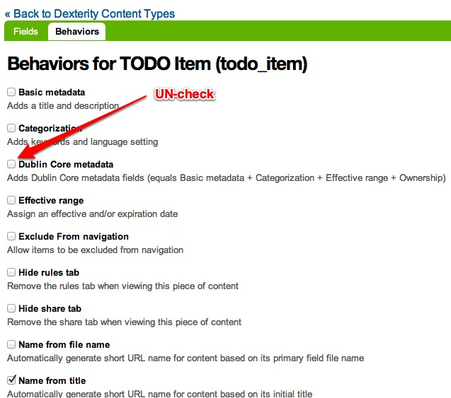

### Next we need to add some fields. Because this type is so simple, we will
   add just one field, but feel free to go CRAZY. Start by going back to the
   ``Fields`` tab and clicking ``Add new field...``.

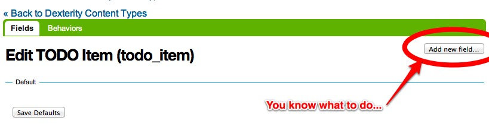

### Add a field called ``Todo``, or anything else you want. But! Note that it's
   very important that the `Short Name` field value is ``title``. By using
   this key short name, we make sure that all Todo Items are searchable from
   smart search. Update the field as seen below and click ``Add``.

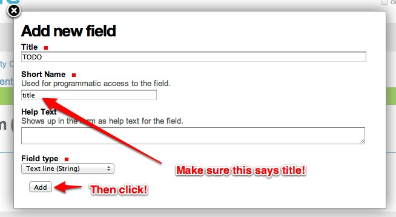

### You will see that a new field has been added to your content type. If you
   are feeling adventuresome, click on the settings tab next to the field to
   set other properties, or just see what’s available.

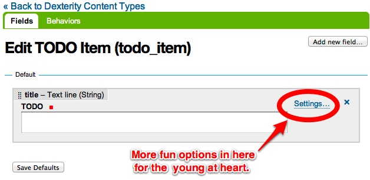

Trying out the Todo Item content-type
-------------------------------------

Now it's time to reap the rewards of all of your effort. Let's put all of our
Todo Items in one particular folder so that we can have collections of items
throughout the site. For this tutorial, we will be putting everything in the
root of the site so it's easy to debug.

### From the root, add a new folder called ``TODO list``.

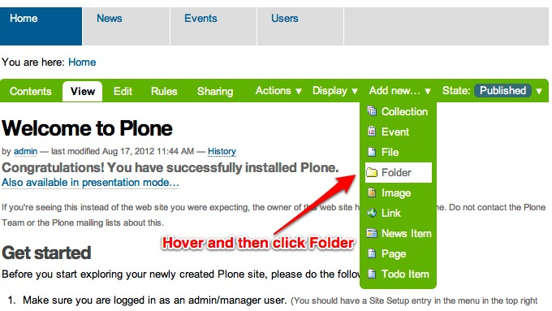

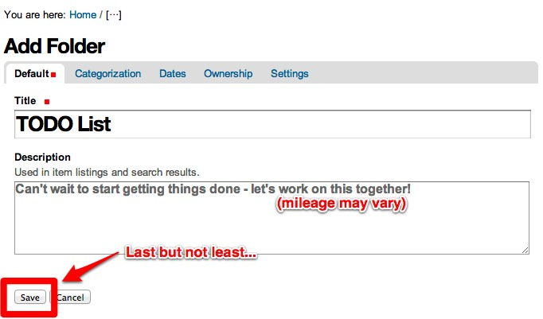

### Add a new `Todo Item` to the new `Todo` folder.

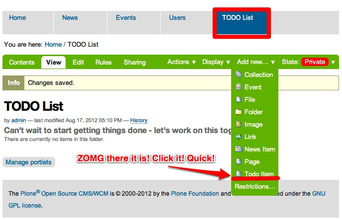

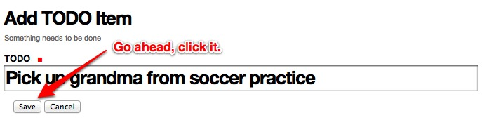

### Celebrate!

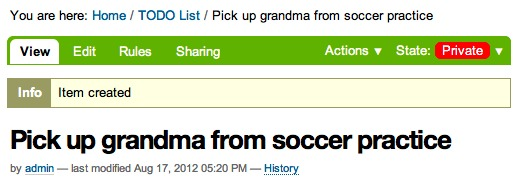

   You may be wondering about earlier, when we asked you to make sure that the
   `short name` for the Todo Item was called ``title``. The time has come to
   let you in on a little secret. Calling the short name either ``title`` or
   ``description`` will automatically add that text to the livesearch menu.
   WHAT?!? I know! When life gives you lemonade, spike it with vodka and enjoy
   liberally! You can now search for your Todo Items in Live Search.

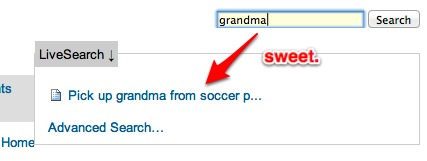

But wait a minute... This todo item is marked ``private``, and that doesn't
really make sense. It's a good thing Plone has an easy solution for that. In
the next section, we will go over the basics of that magical, mystical word:
`workflow`.

Getting Started with Workflows
==============================

So, workflows. What are they? They are a mechanizm to control the flow of a
content item through various states through time. Most commonly, and by default in Plone,
you deal with a `publication` workflow. For example: A writer writes up a News
Item and submits it for reviewal. Then the in-house reviewing team goes through
the text and publishes the News Item so it is public for the entire world to
see.

The Todo Item we added in the last section is marked as ``private`` because by
default all new Plone content types are assigned a complex publication workflow
called ``simple_publication_workflow``. I know what you are thinking:
simple publication whodie whatie grble gobble??!?! Just like before, let's
bypass trying to explain what that means and just fix it. Relax, enjoy, and
finish the tutorial!

Todo Items really have 2 states that we are interested in: `open` and
`complete`. Let's make that happen.

### Head over to the ZMI at ``http://localhost:8080/Plone/manage_main``.
### In the ZMI, open the ``portal_workflow`` tool.

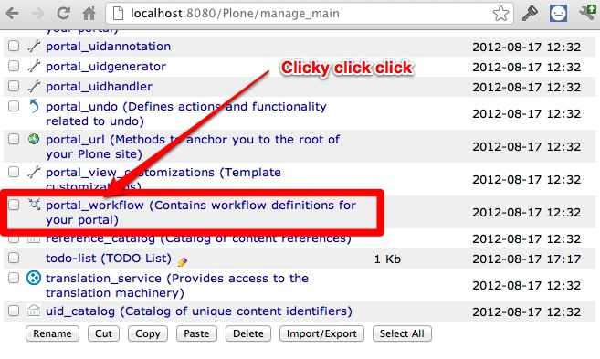

   On this page, we see all content-types in our portal `mapped` to a workflow.
   Our new type, Todo Item, is mapped to ``(Default)``. You can see right below
   that the default is ``Simple Publication Workflow``. This is just too
   complex for our little Todo Item.

### So let's create a new one that suites our needs perfectly! Click the
   ``contents`` tab at the top of the page to get a listing of all the
   available workflows.

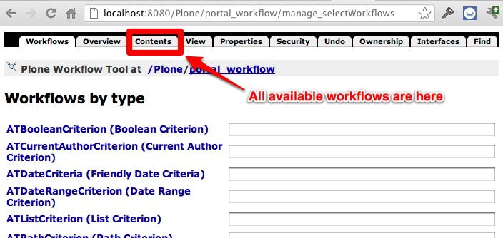

   You can poke around here all you like, but the details of each one of these
   workflows are better left to another tutorial. When in doubt, you can always
   come back to these workflows to see examples of how things can be done.
   Onwards and upwards!

### Let's create a new workflow for our Todo Items and call it
   ``todo_item_workflow``. We will make a new workflow by copying and
   customizing one of the workflows that are already there. Duplicate the
   ``one_state_workflow``.

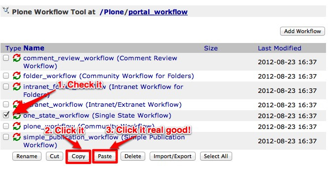

### Rename the copied workflow to ``todo_item_workflow``.

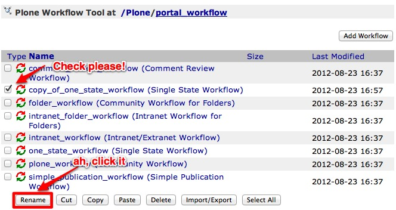

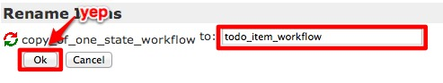

### You will be spit back out to the workflow contents page. Click the workflow
   to start editing.

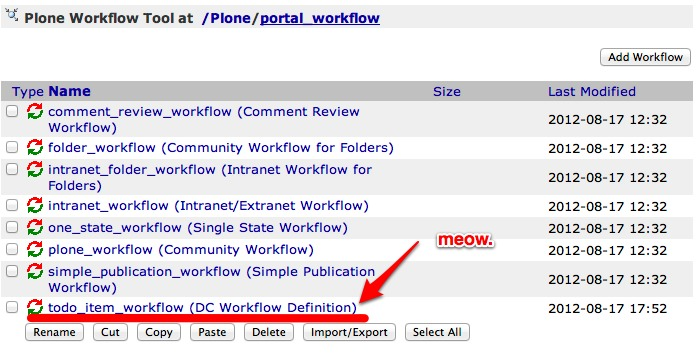

### Let's update the name of the workflow so we don't double take later on.

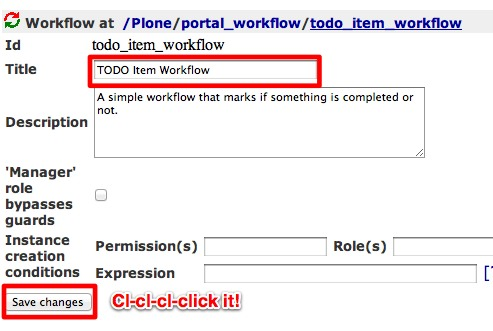

### Workflow is something that takes time to get used to if you have never
   encoutered the concept. The best analogy in our case is to a car. The car
   engine has two simple states: `on` and `off`. To transition from on to off
   and vice versa, it needs some action from the driver. The same for our TODO
   items. They have two states: `open` and `completed`. In order to get them
   from `open` to `completed`, the user needs to click something. Don't
   understand yet? Relax, sit back, and finish the tutorial.

   Lets start by adding our base states. We will call them `open` and
   `complete`. From the edit workflow screen, click on the ``States`` tab.

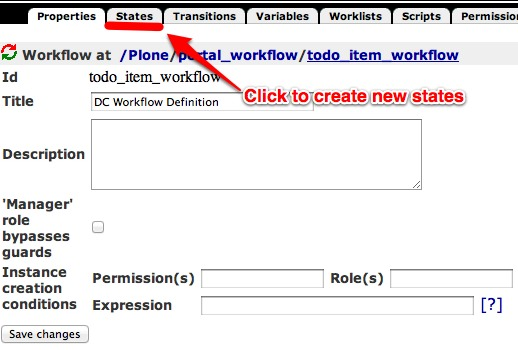

### Delete the currently listed state.

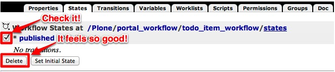

### Add two states with the ids ``open`` and ``completed``.

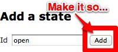

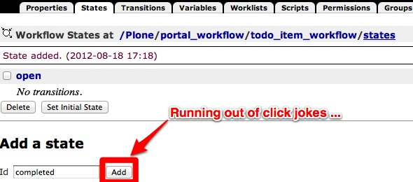

### Next lets add `transitions`. They will take the TODO item from
   `open` to `completed` and vice versa (in case a user wants to revert an item
   back to `open`). Click on the ``Transitions`` tab.
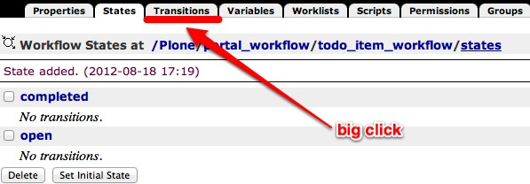

### Add two transitions: `complete` and `reopen`. When a user `completes` a
   task, it will move into the `completed` state. When a user `reopens` a task,
   it will go back to the `open` state.

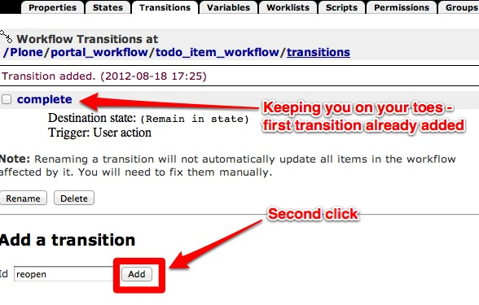

### Let's add a few details to these new transitions. Let's start with
   `complete`. Click on ``complete`` to edit the transition.

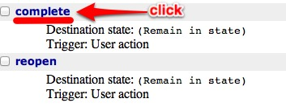

### First add a title so you remember later what this does. Description is
   optional but adding one will help you keep your thoughts clear and remind
   the `future you` what the `today you` is thinking. The destination state
   should be set to ``completed``. We also want to make sure that only people
   with mega permissions, or the creator of the todo item itself, can change
   the state so we add ``Modify portal content`` to the ``Permissions`` box.

   All this means nothing if we don't give the user a chance to change the
   state. Next to ``Display in actions box``, we can set the title for what
   will be displayed in the workflow drop down box of the item (where
   `Pending`, `Reject`, etc. where earlier). Let's call it ``Complete``. Last
   but not least, we need to add the URL that the action points to. I could
   make this tutorial 100 years long and explain why you have to do this, but
   accept that it has to be done, relax, and follow this formula:

   .. code-block:: bash

       URL = %(content_url)s/content_status_modify?workflow_action=X

   where `X` is the id of the transition. So for this case, in the URL box, you
   will add

   .. code-block:: bash

       %(content_url)s/content_status_modify?workflow_action=complete

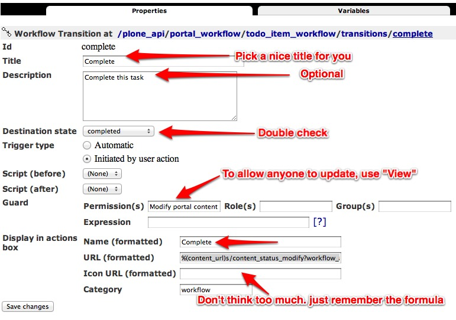

   Double check everything and click ``Save``.

### If your brain isn't hurting yet it will be soon. Go back to the transitions
   listing.

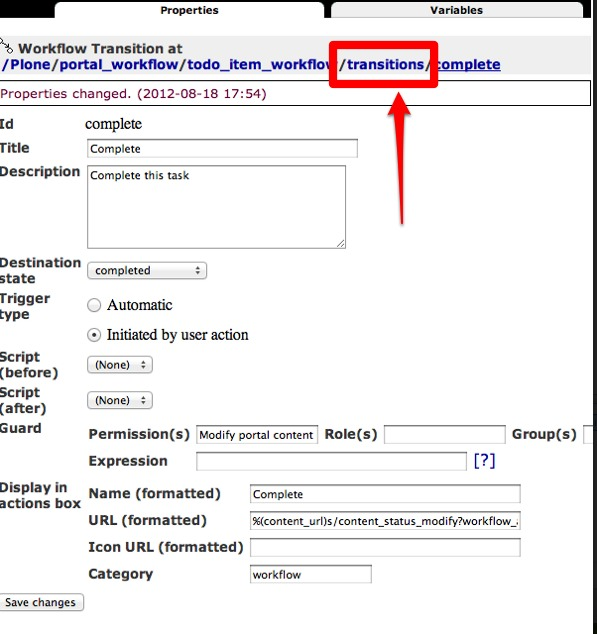

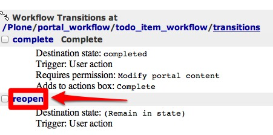

### Let's update the `reopen` transition and update in a similar manner. This
   time, the destination state is ``open``, and following the formula above,
   the URL is ``%(content_url)s/content_status_modify?workflow_action=reopen``.

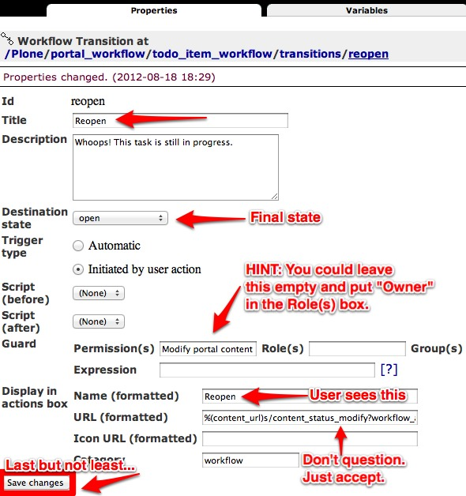

### Now we have 2 states and 2 transitions, but they aren't 100% linked
   together ... yet. Go back to the workflow listing, click the ``States`` tab
   and then click on ``completed`` to edit the state.

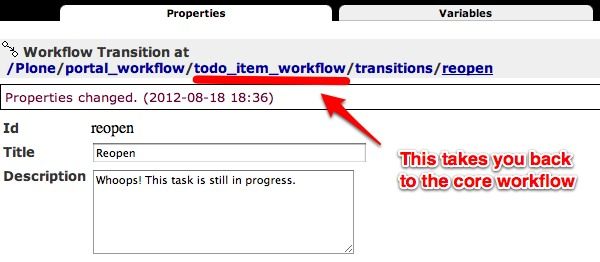

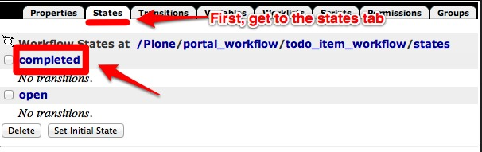

### Add a title, since this is what users see in the top right corner of the
   TODO items, and then check ``reopen`` as a possible transition. This means
   that when a TODO item is completed, it will only allow the user to reopen it
   (and not re-complete it, for example). In the same respect, open the
   ``open`` transition, add a title, and mark ``complete`` as a possible
   transition.

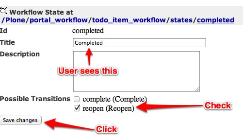

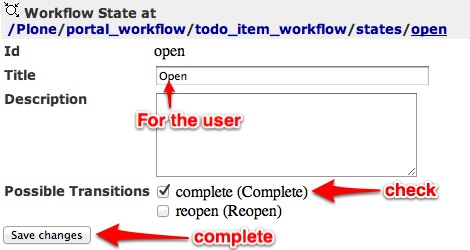

### When we create a new TODO item, we need to tell Plone what the first state
   is. Go back to the workflow states listing, and make ``open`` the initial
   state.

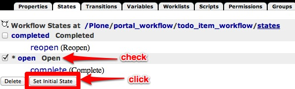

### And that's it! Almost... Last but not least, we need to assign our new
   workflow to our TODO item type. Go back to the main workflow screen.

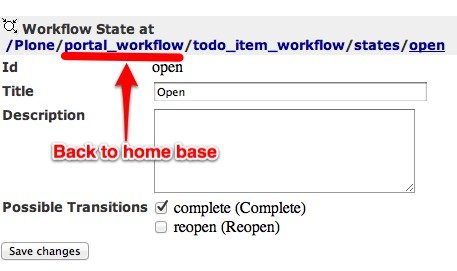

### Instead of mapping to the ``(Default)`` workflow, we are going to map to the
   id of our new workflow, ``todo_item_workflow``, and then click ``Change``.

   If you already have TODO items in your site, you MUST click ``Update
   Security Settings`` to update the workflow for the items. Instead of going
   into gross detail about why this is the case, just sit back, relax, finish
   the tutorial, and remember to click this button any time you make changes
   (yes! you can continue to change and update your workflows!).

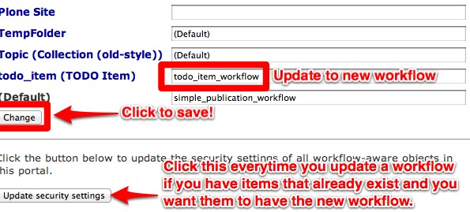

### Could the time have arrived? Time to try it out? YES! Go to your ``Todo``
   folder and add a new TODO Item. Validate that the workflow works as
   expected. By toggling between the states.

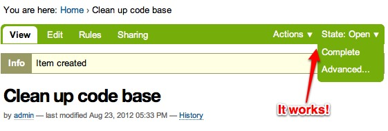

Congrats! You have now passed `Plone Workflow 101`. Next we will transition
from developing through the web (TTW) to developing on the filesystem.

